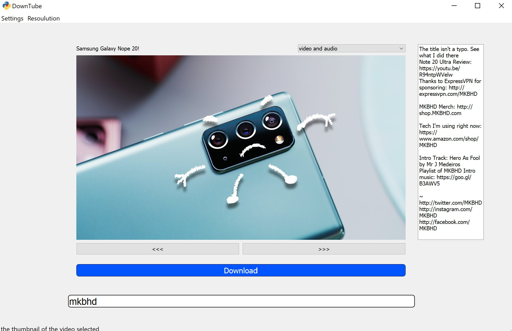

# DownTube

## fast and simple way to download youtube videos
a full fledged youtube downloader with support for searching youtube and 
realtime progressbars

## how to download and install
* download the downtube.zip file
* right click on the file you instaled and then click on extract all
* seach through the extracted folder and double click on DownTube.exe (the file with the DownTube logo)
* if you want to move the file create a shortcut **do not move the file**

